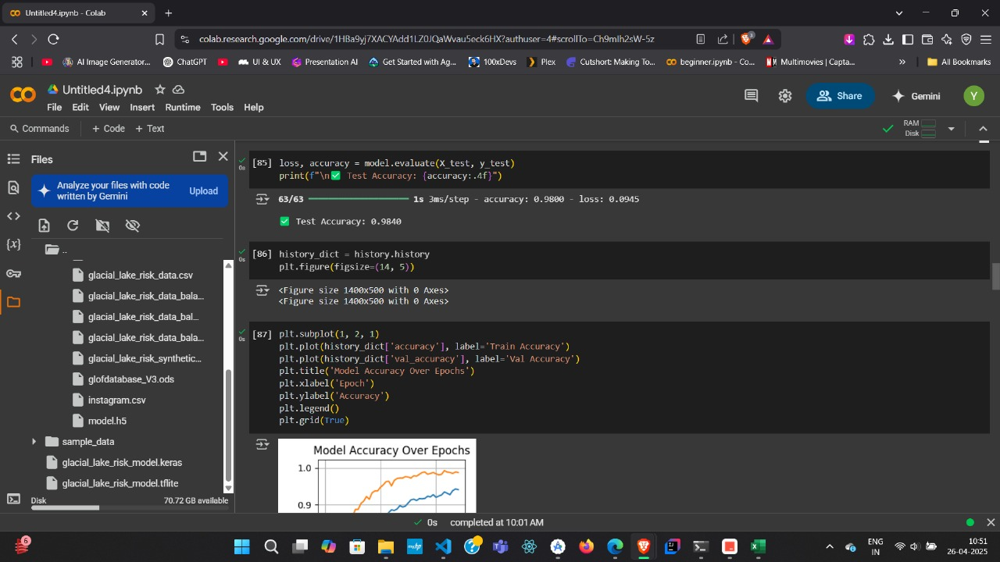

# SafeFlow

 
## 🌊 About

**SafeFlow** is an Android application that monitors and predicts Glacier Lake Outburst Flood (GLOF) risks using AI modeling and real-time data analysis. The app provides early warnings to stakeholders and communities near glacier lakes to help prevent disasters and save lives.

---

## ✨ Features

- **Real-Time Risk Monitoring**: Track GLOF risks using climate and geographical parameters  
- **Interactive Map Interface**: Visualize glacier lakes with dynamic risk indicators  
- **AI-Powered Predictions** based on:
  - Lake name and location  
  - Surface area and volume  
  - Maximum temperature trends  
  - Historical GLOF records  
- **Instant Alerts**: Push notifications when risk levels rise  
- **Stakeholder Communication**: Alert systems for emergency responders and local communities  
- **Offline Capabilities**: Access essential features even in low-connectivity regions  

---

## 🎬 Demo

[](https://youtu.be/pYRq4SVi_9M)

See SafeFlow's GLOF monitoring capabilities in action!

---

## 📦 APK Download

[](https://github.com/shiv10000/SafeFlow/releases/tag/v2.0)

> 📱 Download the latest version of the SafeFlow Android app.

---

## 🛠️ Tech Stack

 

- **Kotlin**: Core language for Android development  
- **Jetpack Compose**: Declarative UI toolkit for building modern UIs  
- **Firebase**: Realtime Database, Authentication, Cloud Messaging  
- **TensorFlow + NumPy + Matplotlib + Scikit-learn**: AI and data visualization stack for backend modeling  

---

## 📱 Screenshots

<div align="center">
  
  
  
</div>
<div align="center">
  
  
</div>


## 🚀 Installation

```bash
# Clone the repository
git clone https://github.com/shiv10000/SafeFlow.git

# Navigate into the project directory
cd SafeFlow

# Open the project in Android Studio and sync Gradle
